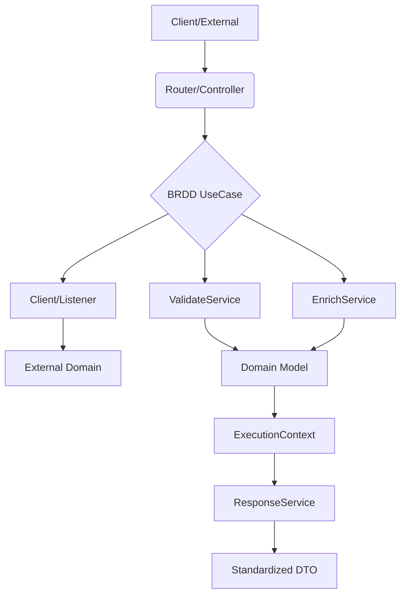

# Business Rule Driven Design (BRDD) 🚀

**Business Rule Driven Design (BRDD)** is an architectural pattern that prioritizes business rules as the primary drivers of software structure. It ensures that every logic branch is traceable, every side effect is documented, and every response is standardized.

BRDD sits as a **Business Logic Layer** that abstracts and formalizes the "Service Layer" found in traditional MVC or Clean Architecture patterns.

---

## 🏛 The Pillars of BRDD

### 1. Unique Rule Coding
Every validation or side effect must have a unique ID (e.g., `PROD_001`). This ID connects the code directly to the [Business Context](file:///home/leo-def/projects/lab/pyducts/BUSINESS_CONTEXT.md).

### 2. Execution Context Narrative
Use Cases return an `ExecutionContext` instead of raw data. This object contains:
- **Data**: The primary result of the operation.
- **Setters**: Automated field assignments (e.g., `SETTER_TIMESTAMP`).
- **Effects**: Side effects triggered (e.g., `EFF_NOTIFY_ADMIN`).
- **Validation**: A clear report of compliance with business rules.

### 3. Service Specialization
BRDD divides logic into specialized roles to maintain clean boundaries:
- **UseCase**: The central orchestrator for a specific business process.
- **ValidateService**: Responsible only for business rule verification.
- **EnrichService**: Responsible for completing data before processing.
- **Client**: The bridge to **External Domains** (Third-party APIs, external services).
- **Listener**: The bridge for **Inbound External Events** (Webhooks, Message Queues).

### 4. Unified Response Pattern
All API interactions follow a strictly standardized JSON format, ensuring a consistent contract for frontend and mobile clients:
```json
{
  "data": { ... },
  "message": "Human-readable message",
  "status": 201,
  "errors": [],
  "setters": ["SETTER_UUID"],
  "effects": ["EFF_LOG_AUDIT"]
}
```

---

## 🔄 The BRDD Flow (MVC Integration)

In a web context, BRDD complements MVC by formalizing the "M" and the interaction between the Controller and the Domain.



## 🏗 BRDD vs MVC / Clean Architecture
Is BRDD "above" MVC? 
BRDD is **orthogonal** to the interaction pattern. While MVC manages *how* the user interacts with the system, BRDD manages *how* the business rules are applied. 
- **In MVC**: It replaces the "Fat Service" or complex "Model" logic with a structured UseCase + Context flow.
- **In Clean Architecture**: It provides a concrete implementation for the "Interactors" layer that prioritizes rule traceability.

## 🎯 Key Benefits
- **Auditability**: Complete visibility into side effects and setters.
- **Consistency**: No more guessing what an endpoint returns.
- **AI-Optimized**: Highly structured patterns make it easy for AI agents to understand and extend the domain.
